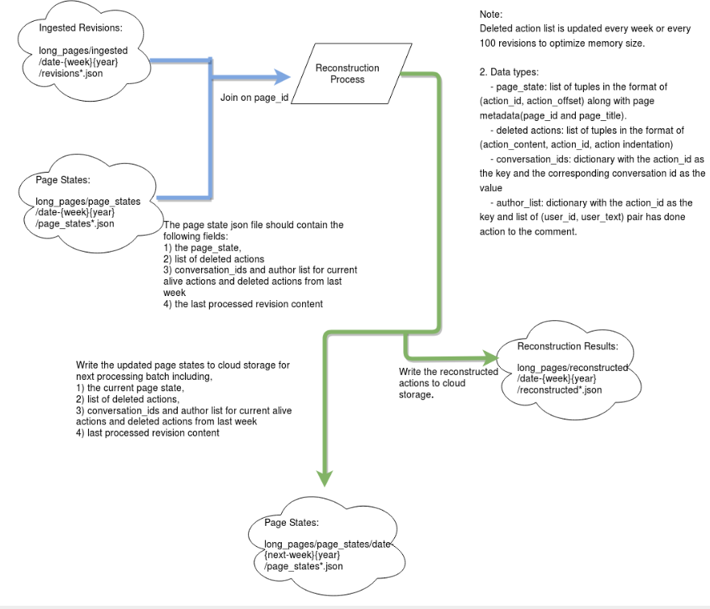

# Conversation Constructor for Wikipedia Talk Pages

This is the codebase for the dataflow pipeline working on constructing conversations from Wikipedia Talk Pages.

Please consult the scripts in helper_shell folder to run the pipeline with correct parameter setting.

The code will read from a join of the following two tables: 
- A table with all revisions ingested in JSON format from wikipedia data dump.
- A table with page states of previous reconstructed revisions.

The workflow can be seen in the following picture:

# Parameters of the code

### Job category
  Specify which kind of data you are processing.
  --category CATEGORY       Specify the job category: long (pages), short (pages),test.

### Input Parmeters
  --input    CLOUD_STORAGE  Specify the locations where you store the ingested avro file. 

### Parameters for the time period to run
  You can select any arbitrary week(ranging from 1 to 53) in 2001 to 2017 to process, using parameters 'week' and 'year'. Revisions from the same page must be processed sequentially in temporal order. Thus make sure you've processed **all the data before week W from year Y**, stored all the page states and last processed revisions in cloud storage.
 
  --week     WEEK           The week of data you want to process
  --year     YEAR           The year that the week is in

# Input Sample
- [Ingested data dump sharded based on week](https://console.cloud.google.com/storage/browser/wikidetox-viz-dataflow/sharded_ingested_short_pages/?project=wikidetox-viz) This is generated using shard.py and the corresponding helper scripts. Please refer to the code for detailed information on data formats.

# Output Sample
- You can find your reconstructed results in the [cloud storage](https://console.cloud.google.com/storage/browser/wikidetox-viz-dataflow/reconstructed_res/?project=wikidetox-viz)
- The updated page states and last processed revisions will be updated to the corresponding folder in [process_tmp](https://console.cloud.google.com/storage/browser/wikidetox-viz-dataflow/process_tmp/?project=wikidetox-viz)

# Efficient Reconstruction Approach

The reconstruction job was parallelized by the pages, and the reconstruction speed on each page largely depends on the number and total size of revisions on a certain page. Since the distribution of number of revisions of each page is not uniform for Wikipedia data, we divided pages into three categories for more efficient reconstruction because of the constraint on memory of dataflow jobs.

- Short pages: Pages with fewer than 100 revisions in total.
- Long pages: Pages with more than 100 revisions but fewer than 100,000 reivisions in total.
- Gigantic pages: Pages with more than 100,000 revisions in total, note that there are only two pages of this kind in our dataset(the talk page of the founder of Wikipedia and Main Page.)

We suggest running the short pages in year by year(see recommended parameter settings in helper_shell/reconstruct_short.sh), long pages week by week(see recommended parameter settings in helper_shell/reconstruct_long.sh). For gigantic pages we process them individually and suggest running it with direct runner.

# Scripts to run different options

We provide two scripts for you to run on different data in helper_shell/.

- reconstruct_short.sh: This will process the relatively short pages, we suggest running with more weeks(~1 year) in one batch.
- reconstruct_long.sh: This will process the relatively longer pages, we suggest running with one week in one batch.
