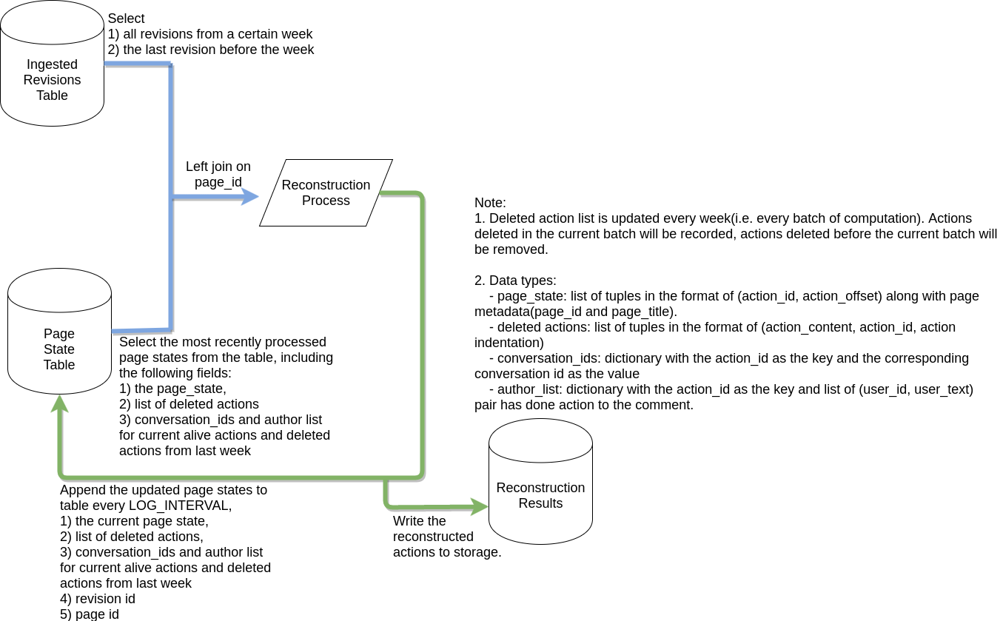

# Conversation Constructor for Wikipedia Talk Pages

This is the codebase for the dataflow pipeline working on constructing conversations from Wikipedia Talk Pages.

Run it with 'python dataflow_main.py --setup_file ./setup.py' 

The code will read from a join of the following two tables: 
- A table with all revisions ingested in JSON format from wikipedia data dump.
- A table with page states of previous reconstructed revisions.

The workflow can be seen in the following picture:

# Optional Parameters

- '--week W --year Y': You can select any arbitrary week(ranging from 1 to 53) in 2001 to 2017 to process, using parameters 'week' and 'year'. Revisions from the same page must be processed sequentially in temporal order. Thus make sure you've processed all the data before week W from year Y, stored all the page states into a page state table, then start running processing on week W and year Y, otherwise there might be mis-parsing of conversations.
- '--initial_reconstruction': If you are starting from the very first revision in Wikipedia data dump, which means no page state table has been processed yet. Start with this option, it doesn't require previously reconstructed page state, just make sure you have ingested raw data dump to a BigQuery table already.
- '--week_lowerbound Wl --week_upperbound Wu --year_lowerbound Yl --year_upperbound Yu': You can select any arbitrary week range from Wl at year Yl to Wu at year Yu, same as the week and year parameter, make sure you've processed all the data before Wl at year Yl. If you've defined week and year already, the code will process the specific week of the year you defined before.

# Input Sample
- [Ingested data dump](https://bigquery.cloud.google.com/table/wikidetox-viz:wikidetox_conversations.ingested_all)
- [Reconstructed page states table](https://bigquery.cloud.google.com/table/wikidetox-viz:wikidetox_conversations.page_states?pli=1)

# Output Sample
- [Reconstructed result](https://bigquery.cloud.google.com/table/wikidetox-viz:wikidetox_conversations.reconstructed_at_week5_year2001?pli=1&tab=preview)
- The updated page states will be appended to [Reconstructed page states table](https://bigquery.cloud.google.com/table/wikidetox-viz:wikidetox_conversations.page_states?pli=1)
