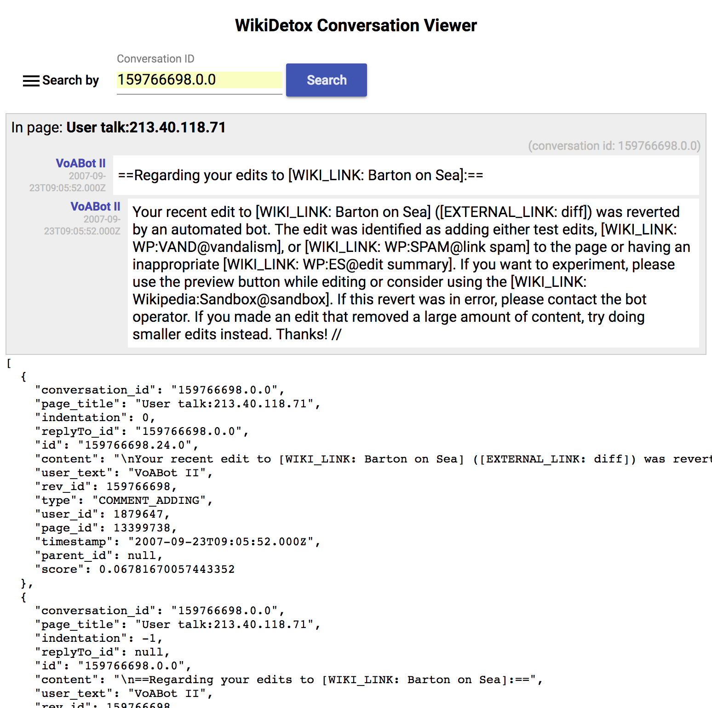

# ConversationAI - Wikidetox Conversation Viewer WebApp

This directory contains a WebApp that uses the
[ConversationAI Wikidetox Conversation Viewer API](../conv-viewer-webapi/README.md)
to talk to Spanner, and then provides a UI for viewing conversations of
the Wikipedia Talk page actions in Spanner. It looks roughly like this:

## Development

This project was generated with [Angular CLI](https://github.com/angular/angular-cli) version 1.6.2.

### Development server

Run `yarn run serve` for a dev server that proxies to port 8080 for the calls to `/api/*` (see `proxy.conf.json`). Then navigate to `http://localhost:4200/`. The app will automatically reload if you change any of the source files. This assumes that you have the WikiDetox `conv-viewer-webapi` webapp running on localhost on port 8080.

### Creating new components and code

Run `ng generate component component-name` to generate a new component. You can also use `ng generate directive|pipe|service|class|guard|interface|enum|module`.

To get more help on the Angular CLI use `ng help` or go check out the [Angular CLI README](https://github.com/angular/angular-cli/blob/master/README.md).

## Build

Run `ng build` to build the project. The build artifacts will be stored in the `dist/` directory. Use the `-prod` flag for a production build.

## Running unit tests

Run `ng test` to execute the unit tests via [Karma](https://karma-runner.github.io).

## Running end-to-end tests

Run `ng e2e` to execute the end-to-end tests via [Protractor](http://www.protractortest.org/).

## About this code

This repository contains example code to to support Conversation AI research; it is not an official Google product.
