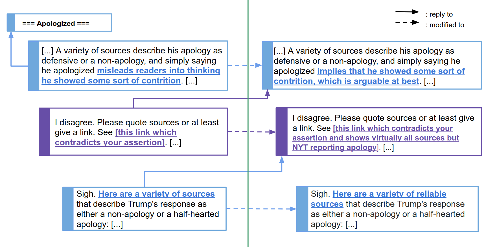

# WikiConv

WikiConv is corpus encompassing the history of conversations on Wikipedia, including deletions, modifications and restorations of comments.

The dataset and reconstruction process for the corpus has been published in the paper [WikiConv: A Corpus of the Complete Conversational History of a Large Online
Collaborative Community](https://arxiv.org/abs/1810.13181), presented at [EMNLP 2018](http://EMNLP2018.org).

The work has also been presented at [the June 2018 Wikipedia reasearch
showcase](https://www.mediawiki.org/wiki/Wikimedia_Research/Showcase#June_2018) (the first half of this pair of talks describes our work using an earlier version of this dataset to predict [conversations going awry](https://arxiv.org/abs/1805.05345)).

WikiConv is a multi-language corpus, it currently includes data dumps from the 20180701 Wikipedia dumps of: English, Chinese, German, Greek, Russian.

## License

The meta-data is goverened by the [CC0 license v1.0](http://creativecommons.org/publicdomain/zero/1.0/), and the content of the comments is goverened by the [CC-SA license v3.0](https://creativecommons.org/licenses/by-sa/3.0/).

## Downloading the dataset

You can find the dataset on Google Cloud storge:
* https://console.cloud.google.com/storage/browser/wikidetox-wikiconv-public-dataset

We are in the process of uploading the dataset to [Kaggle](https://www.kaggle.com/datasets) and [Figshare](https://figshare.com), and will add links here to those once they are available.

If you believe there is information in this dataset that should be removed, you can file an github issue or contact `conversationai-questions@google.com`

## Dataset scale

* Here we define conversations as those with at least two unique participants.

| Language | Talk Pages | Revisions   |   Users   | Conversational Actions | Conversations | Conversations with > 1 participant |
| -------- | ---------- | ----------- | --------- | ---------------------- | ------------- | ---------------------------------- |
|  English | 23,879,193 | 120,167,011 | 4,359,213 |       241,288,668      |   90,930,244  |            48,064,903              |
|  German  |  1,449,874 | 19,138,645  | 1,378,140 |       40,894,283       |   8,603,776   |             7,046,839              |
|  Russian |  1,316,362 | 5,668,182   | 279,123   |       10,849,917       |   4,351,305   |             1,961,593              |
|  Chinese |  2,169,322 | 4,600,192   | 87,005    |       7,731,744        |   3,432,880   |             1,472,086              |
|  Greek   |  120,520   | 525,738     | 24,187    |       951,921          |   351,975     |	              159,522              |

## Dataset format

### Format of the reconstruction actions

Due to Wikipedia's format and editing style, conversations are just snapshots of
a history of edits (called revisions) that take place on a given Talk Page. We
parse these revisions, compute diffs, and separate the edits that were made into
a number of different kinds of 'actions':

*   `CREATION`: An edit that defines a new section in Wiki markup.
*   `ADDITION`: An edit that adds a new comment to the thread of a conversation.
*   `MODIFICATION`: An edit that modifies an existing comment on a Talk Page.
*   `DELETION`: An edit that removes a comment from a Talk Page.
*   `RESOTRATION`: An edit or revert that restores a previously removed comment.

### Schema

Each row of the table corresponds to an action as defined in the section above.
The schema for the table is then:

*   `id`: An id for the action that the row represents.
*   `conversation_id`: The id of the conversation in which the action took
    place. This is usually the id of the first action of the conversation.
*   `page_title`: The name of the Talk Page where the action occurred.
*   `indentation`: In Wiki markup, the level of indentation represents the
    reply-depth in the conversation tree.
*   `replyTo_id`: The id of the action that this action is a reply to.
*   `content`: The text of the comment or section underlying the action.
*   `cleaned_content`: The text of the comment or section underlying the action
    without MediaWiki formats.
*   `user_text`: The name of the user that made the edit from which the action
    was extracted.
*   `rev_id`: The Wikipedia revision id of the edit from which the action was
    extracted.
*   `type`: The type of action that the row represents. This will be one of the
    types enumerated in the previous section.
*   `user_id`: The Wikipedia id of the user making the edit from which the
    action was extracted.
*   `page_id`: The Wikipedia id of the page on which the action took place.
*   `timestamp`: The timestamp of the edit from which the action was extracted.
*   `parent_id`: For modification, removal, and restoration actions, this
    provides the id of the action that was modified, removed, or restored
    respectively.
*   `ancestor_id`: For modification, removal, and restoration actions, this
    provides the id of first creation of the action that was modified, removed,
    or restored respectively.

## Visualization of the English Dataset

You can play with our [visualization of the English
Dataset](http://conv-view.wikidetox-viz.appspot.com/). This data has been scored by the
[Perspective API](https://www.perspectiveapi.com/) so you can now browse the
comments by Toxicity.
Click on the comment to see the whole conversation in which it occurs; click on
the link to be directed to the revision when this comment was posted.
You can also search comments by page or user.

*If you find a comment that contains personal information, please
contacting us at yiqing(dot)cs(dot)cornell(dot)edu and we will notify the Wikimedia Foundation, as well as remove it from this dataset.*

This system is still under development, any suggestions are welcome!

## The Conversation Reconstruction Process

The code in this repository contains a python package that has reconstruction tools to extract the conversation structure
from Wikipedia talk pages.

Please note that this package (currently) uses Python 2.7.

This reconstruction tool aims to show Wikipedia conversations with their full
history; namely also including not just new posts, but also modifications, deletions and reverts.
For example, rather than showing a snapshot of a conversation, such as:


The WikiConv dataset includes all the actions led to its final state:

.

### Setup the environment

In the *current directory*:

- Follow the steps in section 1 to set up [your cloud project](https://cloud.google.com/dataflow/docs/quickstarts/quickstart-python). Note that *do not proceed* to install the newest google cloud dataflow, which may be in-compatible with some of the packages listed in requirements.txt.
- Use your service account to set up boto:
  `gsutil config -e`
- Setup your python environment:
    - Set up a [virtualenv environment](https://packaging.python.org/guides/installing-using-pip-and-virtualenv/)
    - Do . /path/to/directory/bin/activate
    - pip install -r requirements.txt

### Run the pipeline
- Copy the template configuration `template.config` to `config/wikiconv.config` e.g. using
  ```
  rsync --ignore-existing ./template.config ./config/wikiconv.config
  ```
  and then edit the configuration for your cloud resources.
- Run: `run_pipeline.sh`
